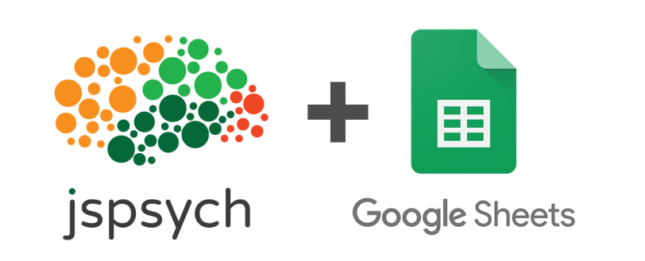

**jsPsychSheet** is a simple JavaScript library that uses jsPsych and Google Sheet for running behavioral experiments online. [jsPsych](https://www.jspsych.org/) is one of the popular JavaScript libraries used to design behavioral experiments to run in a web browser. But to host those experiments online, you need a server (which is not always free), and some knowledge about server-side coding is also required. jsPsychSheet solves that problem by using [Google Apps Script](https://developers.google.com/apps-script) to host your designed experiment and save your data directly into your google sheet. The best part is that you just need to add very few extra lines to your designed jsPsych experiment!

#### [Tutorial on how to use jsPsychSheet](tutorial.md)
