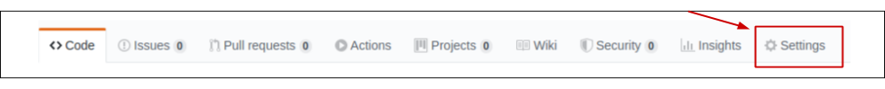
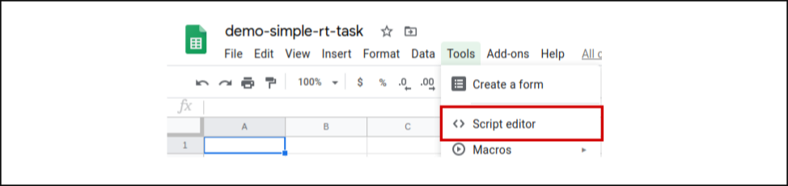
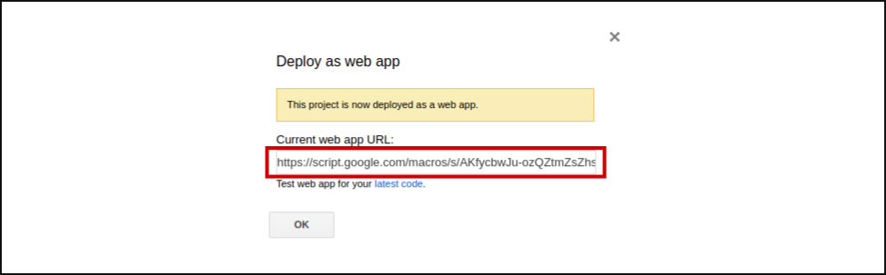

# jsPsychSheet Tutorial: Running jsPsych experiments on Google Apps Script using jsPsychSheet
Three basic steps are needed to run a jsPsych experiment on Google Apps Script:
* Fork [jsPsychSheet](https://github.com/Brain2AI/jsPsychSheet) repo to your own github account and design your experiment inside the experiment folder.

* Modify your jsPsych experiment to use jsPsychSheet

* Host your experiment on Google Apps Script

### Step 1: Fork jsPsychSheet repo to your own github account and design your experiment inside the experiment folder.
After forking jsPsychSheet repo. Go to your forked repo and deploy it as GitHub pages. To do that click on **Settings**.


Within settings navigate to GitHub Pages and select master branch as source. And thats all your repo is deployed as a github page.


Now design your experiment using [jsPsych](https://www.jspsych.org/) inside the `jsPsychSheet/experiment` folder. As an example we will use jsPsych's tutorial [Simple Reaction Time Task](https://www.jspsych.org/tutorials/rt-task/). No need to download jsPsych files, simply use the jsPsych files from `jsPsychSheet/jspsych`.


Check the [original experiment](experiment/demo-simple-rt-task.html) before modification.

### Step 2: Modify your jsPsych experiment to use jsPsychSheet
To use the jsPsych experiment with Google Apps Script, we first change all the local image/file sources to use the source from your GitHub repo. Add the following line at the begning of each of your local sources: `https://your-github-username.github.io/jsPsychSheet/experiment/`. Replace `your-github-username` with your actual GitHub username, for eg: `https://brain2ai.github.io/jsPsychSheet/experiment/`. So, in our example experiment we will have to do following changes:

**Before:**
```html
"<div style='float: left;'></img>" +
"<p class='small'><strong>Press the F key</strong></p></div>" +
"<div class='float: right;'></img>" +
"<p class='small'><strong>Press the J key</strong></p></div>" +
```
```html
var test_stimuli = [
  { stimulus: "img/blue.png", data: { test_part: 'test', correct_response: 'f' } },
  { stimulus: "img/orange.png", data: { test_part: 'test', correct_response: 'j' } }
];
```
**After:**
```html
var test_stimuli = [
  { stimulus: "https://brain2ai.github.io/jsPsychSheet/experiment/img/blue.png", data: { test_part: 'test', correct_response: 'f' } },
  { stimulus: "https://brain2ai.github.io/jsPsychSheet/experiment/img/orange.png", data: { test_part: 'test', correct_response: 'j' } }
];
```
```html
"<div style='float: left;'></img>" +
"<p class='small'><strong>Press the F key</strong></p></div>" +
"<div class='float: right;'></img>" +
"<p class='small'><strong>Press the J key</strong></p></div>" +
```

Next we replace jsPsych library with our online hosted jsPsych library and additionaly add our jsPsychSheet library. Add following lines to the `<head>` of the html file.

**Before:**
```html
<script src="../jspsych/jspsych.js"></script>
<script src="../jspsych/plugins/jspsych-html-keyboard-response.js"></script>
<script src="../jspsych/plugins/jspsych-image-keyboard-response.js"></script>
<link rel="stylesheet" href="../jspsych/css/jspsych.css">
```
**After:**
```html
<!-- jsPsych library -->
<script src="https://brain2ai.github.io/jsPsychSheet/jspsych/jspsych.js"></script>
<script src="https://brain2ai.github.io/jsPsychSheet/jspsych/plugins/jspsych-html-keyboard-response.js"></script>
<script src="https://brain2ai.github.io/jsPsychSheet/jspsych/plugins/jspsych-image-keyboard-response.js"></script>
<link rel="stylesheet" href="https://brain2ai.github.io/jsPsychSheet/jspsych/css/jspsych.css">

<!-- jsPsychSheet library -->
<base target="_top">
<script src="https://brain2ai.github.io/jsPsychSheet/jspsychsheet.js"></script>
<link rel="stylesheet" href="https://brain2ai.github.io/jsPsychSheet/jspsychsheet.css">
```

Now, send your experiment data to jsPsychSheet by calling `jsPsychSheet.uploadData(jsPsych.data.get().csv())` function on finish of your experiment. Do the below change:
```js
jsPsych.init({
  timeline: timeline,
  show_progress_bar: true,
  on_finish: function() {
      jsPsychSheet.uploadData(jsPsych.data.get().csv());
  }
});
```

Check the [modified experiment](experiment/index.html). Push your changes to your jsPsychSheet forked repo on GitHub.

### Step 3: Host your experiment on Google Apps Script
Goto your [google drive](https://drive.google.com/drive/my-drive) and create a "Blank spreadsheet". Now goto Tools and click on "Script editor". A new tab will open with an editor.


You will see a `Code.gs` tab inside the editor. Replace its content with the following:
```js
// App Script function to host the html page
function doGet() {
  return HtmlService.createHtmlOutputFromFile('index');
}

// App Script function to interact with google sheet
function addData(data) {
  var ss = SpreadsheetApp.getActiveSpreadsheet();
  var sheet = ss.insertSheet(0);
  var i;
  for(i=0; i< data.length; i++){
    sheet.appendRow(data[i]);
  }
}
```
Now click on `File >> New >> HTML file`


A pop-up will be displayed asking the file name, write `index.html` and click "OK"


Replace the contents of `index.html` with the contents of your [modified experiment](experiment/index.html). After that click on `Publish >> Deploy as web app...`


Select with whom you have to share your experiment with, select "Anyone, even anonymous" to share with email verification. And then click on `Deploy`


Grant the app permission to access google sheet data.


Congratulations! your experiment is now live... Copy the URL given and share it among your subjects for experiment.



## Accessing your experiment data?
All the experiment data will be stored in the google spreadsheet which you created. For each of the subject you, jsPsychSheet will create a separate sheet inside your spreadsheet.

