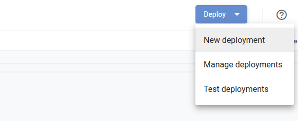

# Getting started with jsPsychSheet: Storing jsPsych experiment data in Google Sheets

Three basic steps are needed to run a jsPsych experiment and store subjects data on Google Sheets:
* Prepare Google Sheets to receive subjects data.

* Modify your jsPsych experiment to use jsPsychSheet.

* Host your experiment on web!

## Step 1: Prepare Google Sheets to receive subjects data.

1. Goto [Google Drive](https://drive.google.com/drive/my-drive) and create a "Blank spreadsheet". Give it a name for example `jsPsychSheet Demo`. Next goto `Tools` and click on `Script editor`.
<div style="border-style: solid; margin: 10px 0px; text-align: center">
  
</div>

1. A new tab will open with an editor for Google Apps Script. See below for an example. Select `Code.gs` from the left sidebar as shown in the image below.
<div style="border-style: solid; margin: 10px 0px; text-align: center">
  
</div>

1. You can give a unique name to your Apps Script for example `jsPsychSheet Demo`. Now replace the contents of the `Code.gs` in Apps Script tab with the contents of the `Code.gs` file provided [here](../Code.gs). After replacement of the contents, it should look like the below screenshot:
<div style="border-style: solid; margin: 10px 0px; text-align: center">
  
</div>

1. Now, go to the top-right corner and click on `Deploy` and then select `New deployment`.
<div style="border-style: solid; margin: 10px 0px; text-align: center">
  
</div>

1. This will open a pop-up window with title "New deployment". Click on the `Select type` icon and select `Web app`.
<div style="border-style: solid; margin: 10px 0px; text-align: center">
  
</div>

1. Then select the options as shown inside the red box in the below image. After that click on `Deploy`
<div style="border-style: solid; margin: 10px 0px; text-align: center">
  
</div>

1. After you click on `Deploy`. It will ask you to authrize access to the Google Sheets. Click on `Autorize access`
<div style="border-style: solid; margin: 10px 0px; text-align: center">
  
</div>

1. This will open a new window to grant access right from your Google account. Select your Google account with the same one which you used to create the Google Sheet. After you select you google account, it say "Google hasn't verified this app". There click on `Advanced` and then `Go to jsPsychSheet Demo (unsafe)`. Note that here jsPsychSheet Demo is the name of Apps Script that intially defined.
<div style="border-style: solid; margin: 10px 0px; text-align: center">
  
</div>
<div style="border-style: solid; margin: 10px 0px; text-align: center">
  
</div>

1. On next page, it will show that jsPsychSheet Demo wants to access your Google Account. Click on the `Allow` button.
<div style="border-style: solid; margin: 10px 0px; text-align: center">
  
</div>

1. Now on the Apps Script page, you will see a success message as shown in the image below. Copy the `Web app URL` for later use.
<div style="border-style: solid; margin: 10px 0px; text-align: center">
  
</div>

## Step 2: Modify your jsPsych experiment to use jsPsychSheet.

Assuming that you have already designed your web experiment using [jsPsych](https://www.jspsych.org/). You need to do only a minor change in the experiment's html file. As an example we will use jsPsych's tutorial [Simple Reaction Time Task](https://www.jspsych.org/tutorials/rt-task/) to show what changes you need to do. This is how most of your jsPsych experiment directory will look like:

<div style="border-style: solid; margin: 10px 0px; text-align: center">
  
</div>

Here `/jspsych` directory contains the latest version of jsPsych package. `/img` directory contains some image stimuli to be used in the experiment. And `index.html` is our designed experiment's html file. We only need to make changes in the `index.html` file so that it can send the subjects data to Google Sheets.

#### You need to do following changes:

Import `jsPsychSheet` and `jQuery` by adding the following lines inside the `<head>...</head>` tags.

```html
<!-- jsPsychSheet library -->
<script src="https://brain2ai.github.io/jsPsychSheet/jspsychsheet.js"></script>
<link rel="stylesheet" href="https://brain2ai.github.io/jsPsychSheet/jspsychsheet.css">

<!-- jQuery -->
<script src="https://ajax.googleapis.com/ajax/libs/jquery/3.5.1/jquery.min.js"></script>
```

Send the experiment data to jsPsychSheet by calling `jsPsychSheet.uploadData(<Web app URL>, jsPsych.data.get().csv())` function `on_finish` of your experiment inside the `jsPsych.init(...)` function call. Here `<Web app URL>` is the URL that you copied after deploying the Google Apps Script. For example you will have to do the following:
```js
jsPsych.init({
  timeline: timeline,
  show_progress_bar: true,
  on_finish: function () {
    url = "https://script.google.com/macros/s/AKfycbzWarG1igduvFgcS8noKcvJ_RCX_ajtlYJQ1cOrCpTFtCrlaFlqSv-Cg2JJDQciFs4ePA/exec";
    jsPsychSheet.uploadData(url, jsPsych.data.get().csv())
  }
});
```

Rest of the things will be taken care of by the jsPsychSheet library. It will send the data to Apps Script which will then save it inside the linked Google Sheet that you created in the begning of the tutorial. You can compare the differences between the [original jsPsych experiment](../experiment/demo-simple-rt-task.html) file with the [modified experiment](../experiment/demo-simple-rt-task-modified.html) file.

## Step 3: Host your experiment on the web!

So, this is the final step to get your experiment running online. If have your own web space and domain name you can simply upload all the experiment files there. Or you can use [GitHub Pages](https://pages.github.com/) to host your experiments file for FREE. Follow the steps shown below to use GitHub Pages:

1. Open your GitHub profile and create a new public repository:
<div style="border-style: solid; margin: 10px 0px; text-align: center">
  
</div>

1. If you are familier with Git and GitHub, use you preferred way of adding files to your newly created repository. If you are not familier, you can simply follow a simple drag drop method to upload your experiment files. Once you create the repository, GitHub will take you to the repository page where you can find the following link to upload files `uploading an existing file`.
<div style="border-style: solid; margin: 10px 0px; text-align: center">
  
</div>

1. Clicking on that link will open a simple drag and drop file upload method. Drag the experiment html file along with the folders and drop on the area shown. You can directly drag and drop the complete folder, there's no need to individually upload the files inside a given folder. Do not use `choose your files`, that will not support uploading of folders. After all the files gets uploaded click on the `Commit changes` button. This will add all the files to your GitHub repository.
<div style="border-style: solid; margin: 10px 0px; text-align: center">
  
</div>
<div style="border-style: solid; margin: 10px 0px; text-align: center">
  
</div>

1. Now open the `Settings` page:
<div style="border-style: solid; margin: 10px 0px; text-align: center">
  
</div>

1. In the settings page, you will see a `Pages` tab in the left-bar. Click on it and then select the options as shown in the image below and then click on the `Save` button.
<div style="border-style: solid; margin: 10px 0px; text-align: center">
  
</div>

1. After this you will see a confirmation message that your site is ready to be published. Copy the link inside blue box. After 2-3 minutes your experiment will be live on that link.
<div style="border-style: solid; margin: 10px 0px; text-align: center">
  
</div>

Now you can run the experiment by opening the link or share it with your subjects to complete it. At completion of the experiment by the subject, the data will be uploaded to Google Sheets. jsPsychSheet will automatically give unique IDs to every new instance of the experiment. This ID will be represented by the `sheet_sub_id` column in the spreadheet. If you want to remove data from anyone of the subjects, simply delete it from your spreadsheet.
